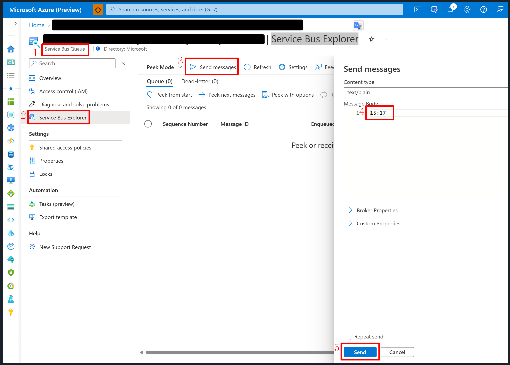

# Problem Reproduce

This project is used to reproduce a problem about using `com.azure.spring:spring-integration-azure-servicebus:4.5.0`.

## Steps To Reproduce The Problem

1. Create an Azure Service Bus. Refs: [Use Azure portal to create a Service Bus namespace and a queue](https://learn.microsoft.com/en-us/azure/service-bus-messaging/service-bus-quickstart-portal).
2. Fulfill necessary properties in `application.yml`.
    ```yaml
    problem:
      reproduce:
        service:
          bus:
            properties:
              connection-string: # Fulfill here
              entity-name: # Fulfill here
    ```
3. Start current application. 
4. Send message by Azure Portal. Refs: [Use Service Bus Explorer to run data operations on Service Bus](https://learn.microsoft.com/en-us/azure/service-bus-messaging/explorer). Here is an screenshot:
   
5. Check logs in the running application. Here is the log in my localhost:
    ```txt
    New message received: '15:17'.
    Message '15:17' successfully checkpointed.
    ```
